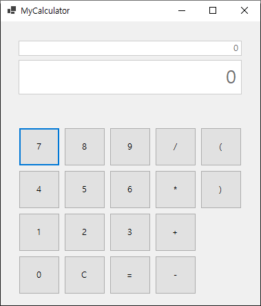

# C\# 프로그래밍

## Ch 01. Hello Word
## Ch 02. 변수, 자료형, 연산자
	- 1. 변수
	- 2. 자료형
	- 3. 연산자
	- 4. 입력테스트
	- 5. 자료형 변환
	- 6. 문자열

## Ch 03. 조건문, 스위치, 반복문, 배열
	- 1. if
	- 2. switch
	- 3. for
	- 4. while
	- 5. array

## Ch 04. 메소드
	- 1. Method
	- 2. MethodType
	- 3. MethodOverload
	- 4. MethodStack
	- 5. MethodParameter

## Ch 05. 클래스
	- 1. Class
	- 2. Encaps
	- 3. Static
	- 4. Inheritance
	- 5. Override
	- 6. Polymorphism

## Ch 06. 다형성
	- 1. AbstractClass
	- 2. Interface
	- 3. Strucutre
	- 4. Generic
	- 5. Indexer
	- 6. InternalClass

## Ch 07. 컬렉션
	- 1. Stack
	- 2. Queue
	- 3. ArrayList
	- 4. HashTable
	- 5. HashSet

## Ch 08. 예외 처리, 파일 입출력
	- 1. Try-Catch
	- 2. Throw
	- 3. FileIO

## Ch 09. 델리게이트, 람다, 린큐
	- 1. Delegate
	- 2. Lambda
	- 3. Linq

## Ch 10. 데이터베이스 연동
	- 1. DBConnection
	- 2. Insert
	- 3. Select

## Ch 11. WinForm 기초
	
## Project1. 계산기

1. 프로젝트 유형
	- WinForm 프로젝트
2. 활용 기술
	- 컨트롤
	- 이벤트와 핸들러
	- 스택을 이용한 괄호, 사친연산 우선순위 계산
